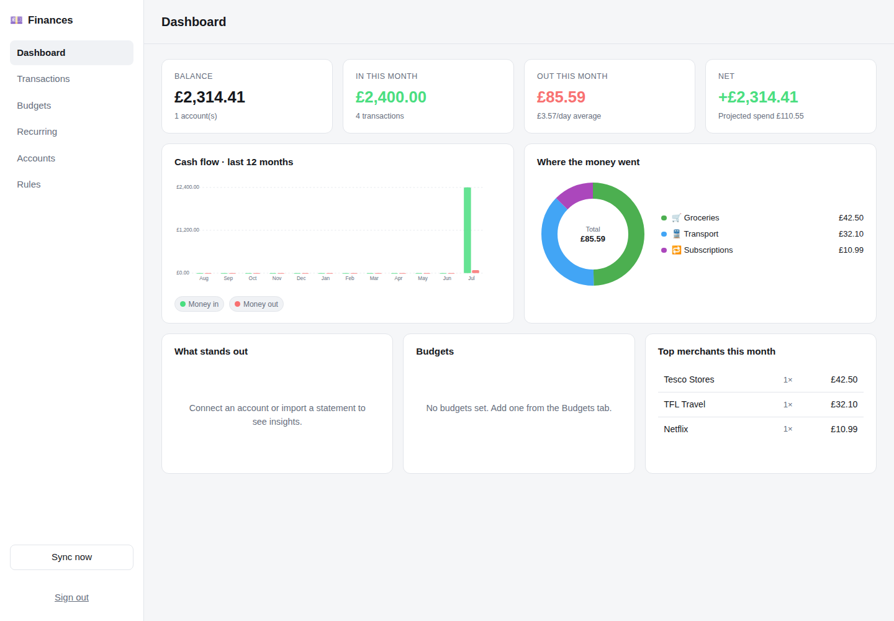

# Financial Manager

A self-hosted personal finance manager that connects to Revolut. It pulls your
accounts and transactions in, categorises them, tracks budgets, spots recurring
payments, and shows you where the money actually goes.

Everything runs on your own machine. Your data lives in a local SQLite file and
is never sent anywhere except to the bank API you connect.



## What it does

- **Runs on your phone** — install the Android APK, or add the web app to your
  home screen. Both talk to the server you run.
- **Answers questions about your money** — an AI assistant with read-only access
  to your own transactions. Optional, and off until you add an API key.
- **Connects to Revolut** — personal accounts via Open Banking, business accounts
  via Revolut's own API, or neither (CSV import works standalone).
- **Categorises automatically** — merchant keywords, Revolut's own transaction
  types and MCC codes, plus your own rules. Anything you set by hand stays set.
- **Budgets** — monthly limits per category, with pace tracking so you know
  whether you're on course halfway through the month.
- **Recurring payments** — finds subscriptions and standing costs in your own
  history and totals what they cost you per year.
- **Insights** — plain-language notes on the dashboard: spending up vs last
  month, categories that jumped, budgets blown, cash flow negative.
- **Search, edit, export** — full transaction history, filterable, exportable
  back out to CSV.

## Installing on your phone

Two ways, both pointing at the server you run.

### The Android app

Grab `dist/financial-manager-release.apk` from this repo, copy it to your phone,
and open it. Android will ask you to allow installing from this source — that's
expected for an app that isn't from the Play Store.

On first launch it asks for your server's address. **The server has to be
running first** — the app is a client, it has no data of its own.

Start the server (`./run.sh`) and it prints exactly what to type:

```
On this computer:      http://localhost:8000
From your phone:       http://192.168.1.20:8000   <- use this in the app
```

Type that second address into the app, with or without `http://`. Don't use
`localhost` — on a phone that means the phone itself.

The phone and the computer must be on the same WiFi. To reach it from outside
your home, put both on a VPN like [Tailscale](https://tailscale.com) and use the
address it gives you. The app checks the address responds before saving it, so
you'll know immediately if it can't get through.

To build it yourself:

```bash
./build-apk.sh          # needs a JDK, Gradle, and an Android SDK (platform 35)
```

The APK is signed with Android's standard debug key, which is enough to install
it on your own device. Sign it with your own key before distributing it anywhere.

The app is a native shell around the same web UI, which means CSV import, CSV
export and the assistant all work as they do in a browser. One deliberate
exception: **bank authorisation links open in your real browser**, because banks
reject login pages inside an embedded app view. Approve access there, and the
connection is waiting when you switch back.

### Or: add it to your home screen

The web app is installable as a PWA. Open it in Chrome or Safari and choose
"Add to home screen" — you get the same icon and full-screen app, with no APK to
sideload. The app shell is cached so it opens instantly; financial data never is,
so you can't be shown a stale balance.

## Getting started

**On Windows? Read [WINDOWS.md](WINDOWS.md)** — no terminal or git needed, four
steps with a download link.

One command, on Windows, macOS or Linux:

```bash
python start.py
```

**On Windows you can also just double-click `start-windows.bat`.**

It creates a private Python environment, installs everything, generates your
encryption keys, picks a free port, starts the app, and opens your browser.
First run takes a few minutes for the installs; after that it's a few seconds.
Run it again any time — it skips whatever is already done.

You need **Python 3.11 or newer**, from [python.org](https://www.python.org/downloads/).
On Windows, tick *Add python.exe to PATH* during installation. Nothing else.

Create your account when the browser opens. The first sign-up claims the
instance and registration then closes.

**No computer at all?** See **[DEPLOY.md](DEPLOY.md)** — it puts this on a free
host using only a phone browser.

### If something goes wrong

The launcher explains failures rather than dumping a traceback: a too-old
Python, a missing `venv` module, no free port, a network problem during install.
Read the message — it names the fix.

`./run.sh` is still there for Linux and macOS if you prefer a shell script, but
`start.py` is the supported path and the one that works everywhere.

Prefer to do it entirely by hand:

```bash
python3 -m venv .venv && source .venv/bin/activate
pip install -r requirements.txt
cp .env.example .env
python -m backend.app.security --new-key     # → ENCRYPTION_KEY
python -m backend.app.security --new-secret  # → SESSION_SECRET
uvicorn backend.app.main:app --reload
```

You can use the app immediately with CSV import. Connecting a bank needs a few
more minutes of setup, below.

## Connecting Revolut

### Personal Revolut account

Revolut has no public API for retail customers. It is, however, a regulated bank
under UK/EU Open Banking, so a licensed account-information provider can read it
with your consent. This app uses **GoCardless Bank Account Data**, which has a
free tier that covers Revolut in the UK and across the EEA.

1. Sign up at <https://bankaccountdata.gocardless.com/>.
2. Go to **Developers → User secrets** and create a secret ID + key.
3. Add `http://localhost:8000/api/connections/gocardless/callback` to the allowed
   redirect URIs on your account.
4. Put the ID, key and redirect URI in `.env`.
5. Restart the app, then **Accounts → Connect a bank → Connect Revolut**. You'll
   be sent to Revolut to approve read-only access.

Once connected, it keeps itself current: the app re-syncs each connection about
twice a day on its own, and **Sync now** is there if you want it immediately.
Nothing to schedule, no cron entry — it runs inside the app.

Two things to know about this route:

- **Consent expires after 90 days.** That's the regulatory maximum, not a choice
  this app makes. The connection will show as `expired` and you reconnect.
- **Production rate limit: 4 calls per account per day.** Sync once or twice a
  day, not on a loop.

### Revolut Business account

1. In the Revolut Business portal, go to **Settings → API**, upload an X.509
   certificate, and note the client ID.
2. Set `REVOLUT_CLIENT_ID`, `REVOLUT_PRIVATE_KEY_PATH` (the private key matching
   that certificate) and `REVOLUT_REDIRECT_URI` in `.env`.
3. Leave `REVOLUT_ENVIRONMENT=sandbox` until you've tried it, then switch to
   `production`.
4. **Accounts → Connect a bank → Connect Revolut Business**.

Access tokens last ~40 minutes and refresh automatically. The refresh token dies
with the certificate (90 days by default), after which you re-authorise.

### CSV import

Works with no setup at all. In the Revolut app: **Statement → Excel/CSV →
Download**. Then **Accounts → Add manual account**, and **Import CSV** on it.

Re-importing an overlapping file is safe — rows are deduplicated on a hash of
date, amount, description and reference, so you never get doubles.

## The AI assistant

Optional and off by default. Add `ANTHROPIC_API_KEY` to your `.env` and three
things turn on.

**Ask questions about your own money.** The Assistant tab is a chat backed by
Claude with eight read-only tools over your database — transaction search,
spending summaries, category breakdowns, cash flow, recurring payments, budgets,
accounts and top merchants. Ask "how much did I spend on groceries this year" or
"what are my biggest subscriptions" and it queries your real figures rather than
guessing. Each answer shows which tools it consulted, so you can check its work.

It is deliberately narrow: those eight query tools are the entire surface it can
reach. It cannot move money, change a transaction, alter a rule, or browse the
web — there is no tool for any of that. It is also told to say when your data
doesn't answer the question, instead of estimating.

**Sort out messy merchants.** *Rules → Ask AI to sort the rest* takes the
merchant names the built-in rules couldn't place and asks Claude to identify
them. Each answer is saved as an ordinary rule, so it costs one call per new
merchant rather than one per transaction, and you can inspect, edit or delete
what it decided. Low-confidence guesses are discarded rather than applied.

**A written monthly read.** The dashboard can generate a few sentences on how the
month is going, from this month's figures and last month's.

### What is sent, and what isn't

Only what a question needs: merchant names, dates, amounts, category totals.
Never your account numbers, IBANs, credentials, or who you are. Nothing is sent
at all until you set an API key — and if you never set one, every other feature
in this app works exactly as before.

### Which model

The default is **Claude Haiku 4.5** — the cheapest model that handles this work
well, chosen so a small amount of API credit lasts a long time. Merchant
categorisation and straightforward questions ("what did I spend on groceries in
March") are well within it.

Set `AI_MODEL=claude-opus-5` in `.env` for sharper answers on vague or
multi-step questions, at roughly five times the cost.

Requests adapt to the model automatically: `AI_EFFORT` and the server-side
refusal fallback are only sent to models that accept them, because Haiku
rejects both outright. Switching models is a one-line change with nothing else
to adjust.

## How categorisation works

Three layers, first match wins:

1. **Your rules** — created under *Rules*, applied in priority order.
2. **Provider hints** — Revolut's transaction type and merchant category code.
   Vague ones (`topup`, `transfer`, `exchange`) only apply if nothing else matches,
   so a salary arriving as a TOPUP is still filed as Salary.
3. **Keyword heuristics** — a built-in merchant list, matched whole-word.

Editing a category in the UI locks that transaction: later re-categorisation
passes leave it alone unless you explicitly ask to overwrite hand-set categories.

## Multi-currency

Balances and totals are grouped **per currency** and never combined using an
invented exchange rate. Your base currency is the headline; other currencies are
listed separately on the dashboard. If you want them converted, that's a
deliberate feature to add — it needs a rate source and a decision about which
day's rate applies.

## Security

- Bank tokens are encrypted with Fernet (AES-128-CBC + HMAC) before they touch
  disk, keyed by `ENCRYPTION_KEY`.
- Passwords are PBKDF2-SHA256, 240k rounds, per-user salt.
- Sessions are opaque random tokens; only an HMAC of each is stored, in an
  httpOnly cookie. Set `COOKIE_SECURE=true` when serving over HTTPS.
- OAuth callbacks are CSRF-protected with single-use state tokens that expire
  after 20 minutes.
- Every connection is **read-only**. This app cannot move your money — no
  payment-initiation scope is requested anywhere.
- `.env`, `data/`, `secrets/` and `*.pem` are gitignored. Don't commit them.

If you expose this beyond localhost, put it behind HTTPS and a reverse proxy.
It's built as a single-user personal instance, not a multi-tenant service.

## Layout

```
backend/app/
  main.py            FastAPI app, static file serving
  config.py          settings from .env
  models.py          SQLAlchemy schema (money stored as integer minor units)
  security.py        password hashing, sessions, credential encryption
  providers/
    base.py            provider interface + normalised shapes
    gocardless.py      Revolut personal, via Open Banking
    revolut_business.py Revolut Business API
    csv_import.py      statement parsing
  services/
    sync.py            fetch → dedupe → upsert
    categorise.py      rules, provider hints, keyword heuristics
    analytics.py       summaries, cash flow, budgets, recurring detection
    ai.py              Claude: merchant categorisation, written briefing
    ai_agent.py        Claude: chat, and the read-only tools it may call
  routers/           HTTP endpoints
frontend/            single-page client, no build step; installable as a PWA
android/             native Android shell around the web UI
dist/                prebuilt APK
tests/               119 tests
```

Adding another bank means writing one module in `providers/` — nothing above
that layer knows which bank it's talking to.

## Tests

```bash
pip install -r requirements-dev.txt
pytest
```

119 tests covering money arithmetic, CSV shapes, categorisation precedence,
sync idempotency, analytics maths, the API's auth boundaries, and the AI layer —
including that a refusal is never read as an answer, that the model cannot invent
a merchant to write a rule for, and that low-confidence guesses are discarded.
Bank and Claude APIs are both mocked; no test touches the network.

API docs, while the app is running: <http://localhost:8000/docs>.

## Limitations

- **Syncing is twice a day, not live.** Banks don't push updates here, so the
  app polls. `AUTO_SYNC_INTERVAL_HOURS` changes the pace, but the aggregator's
  ~4 reads per account per day is the real ceiling. *Sync now* is always there.
- **No FX conversion**, by design (see above).
- **Read-only.** No payments, transfers or standing-order changes.
- **Single user per instance.**
- **Deployed publicly, sign-up is gated by a code** (`SIGNUP_TOKEN`) so the
  first visitor can't claim your instance. Not needed on a home network.
- **AI answers are only as good as your data.** The assistant reads what has been
  synced or imported — it cannot see an account you haven't connected.
- Open Banking gives you up to 730 days of history, depending on what the bank
  returns. CSV import is the way to go further back.
